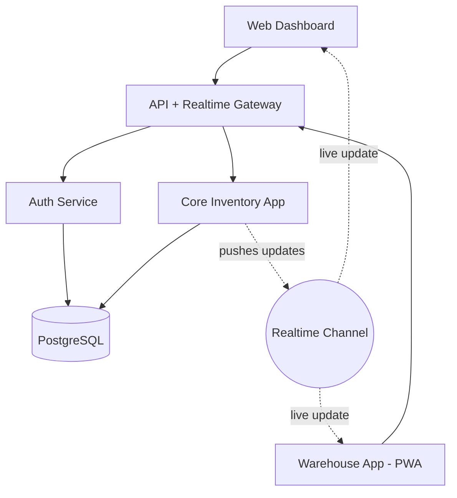

# OdooxGCEThyderabadHackathon
Official repository for entry in the Odoo x GCET Hyderabad Hackathon 2026
<div align="center">

# 📦 StockSense

### Real-time inventory & warehouse management for teams that move stock every day


</div>

---

## 📑 Table of contents

- [Overview](#-overview)
- [Key features](#-key-features)
- [Tech stack](#-tech-stack)
- [Architecture](#-architecture)
- [Roles & permissions](#-roles--permissions)
- [Screenshots](#-screenshots)
- [Getting started](#-getting-started)
- [Project structure](#-project-structure)
- [Security](#-security)
- [Roadmap](#-roadmap)
- [License](#-license)

---

## 📖 Overview

StockSense is a real-time inventory and warehouse management system built for two kinds of users: **Inventory Managers**, who need visibility and control across warehouses, and **Warehouse Staff**, who run the day-to-day receiving, picking, transferring, and counting. It replaces spreadsheets and paper counts with a live, auditable system of record — every unit received, moved, or adjusted is tracked back to a single source of truth.

## ✨ Key features

- 📊 **Live dashboard** — stock levels, pending documents, and low-stock alerts update in real time, no refresh needed
- 📦 **Product & category management** with configurable reorder thresholds
- 📥 **Receipts** — record incoming stock from suppliers; validating a receipt updates stock automatically
- 📤 **Delivery orders** — pick, pack, and ship outgoing stock
- 🔄 **Internal transfers** — move stock between warehouses, zones, or bins
- 🧮 **Inventory adjustments** — reconcile physical counts against system records, with manager approval required above a configurable threshold
- 🕓 **Move history** — a complete, immutable audit trail of every stock movement
- 🔐 **Role-based access** — Managers and Staff see and can do different things, enforced at the database layer, not just hidden in the UI
- ✉️ **Secure password reset** via a time-limited, one-time email code

## 🧱 Tech stack

| Layer | Technology |
|---|---|
| Frontend | React, TypeScript, Tailwind CSS, shadcn/ui |
| Backend | Supabase — Postgres, Auth, Storage, Edge Functions |
| Realtime | Supabase Realtime (Postgres change streams) |

## 🏗️ Architecture



Every stock-changing action writes to the database and the same transaction pushes a live update to connected dashboards — no polling.

## 🔐 Roles & permissions

| Role | Can do | Cannot do |
|---|---|---|
| **Inventory Manager** | Everything — products, warehouses, approvals, all documents | — |
| **Warehouse Staff** | Create/update receipts, deliveries, transfers; submit adjustments | Delete products, approve adjustments, manage warehouses |

## 📸 Screenshots

> _Add screenshots of the dashboard, receipts flow, and mobile warehouse view here once available._

| Dashboard | Receipts | Warehouse view |
|---|---|---|
| _coming soon_ | _coming soon_ | _coming soon_ |

## 🚀 Getting started

### Prerequisites
- Node.js 18+
- A [Supabase](https://supabase.com) project

### Installation
```bash
git clone <your-repo-url>
cd stocksense
npm install
cp .env.example .env
npm run dev
```

<details>
<summary>🔑 Environment variables</summary>

| Variable | Description |
|---|---|
| `VITE_SUPABASE_URL` | Your Supabase project URL |
| `VITE_SUPABASE_ANON_KEY` | Your Supabase anon/public key |

Never commit real keys — `.env` is gitignored.

</details>

## 🗂️ Project structure

```
src/
  components/   # shared UI — status badges, data table, KPI cards, filter bar
  pages/        # Dashboard, Products, Receipts, Deliveries, Transfers, Adjustments, Move History, Settings
  hooks/        # auth context, data fetching, realtime subscriptions
supabase/
  migrations/   # schema + row-level security policies
```
> Indicative structure — check your generated project for the exact layout.

<details>
<summary>📋 Core data model</summary>

`profiles` · `warehouses` · `locations` · `product_categories` · `products` · `inventory_items` · `receipts` (+ lines) · `delivery_orders` (+ lines) · `internal_transfers` (+ lines) · `inventory_adjustments` (+ lines) · `move_history`

Full schema and row-level security policies live in `supabase/migrations` — not duplicated here since they change as the app evolves.

</details>

## 🔒 Security

- Row-level security enforced at the database layer, on every table
- Role checked server-side on every request — never trusted from the client
- Every stock movement is written to an immutable audit log (`move_history`)
- Password reset via a time-limited, one-time email code rather than a long-lived link

## 🗺️ Roadmap

- [x] Auth, navigation shell, dashboard
- [ ] Receipts, delivery orders, internal transfers
- [ ] Inventory adjustments with approval workflow
- [ ] Real-time dashboard updates
- [ ] Barcode/QR scanning for warehouse staff
- [ ] Low-stock email alerts
- [ ] Batch/lot & expiry tracking
- [ ] Offline support for the warehouse view

## 📄 License

_Add your preferred license here (MIT, Apache-2.0, etc.)._

---

<div align="center">

Built by 
**Sasi** — B.Tech (AI & ML), Aditya University
**Jyotshna** — B.Tech (CSE), Aditya University
**Asritha** — B.Tech (CSE), Aditya University
**Pragnya** — B.Tech (CSE), Aditya University

</div>
